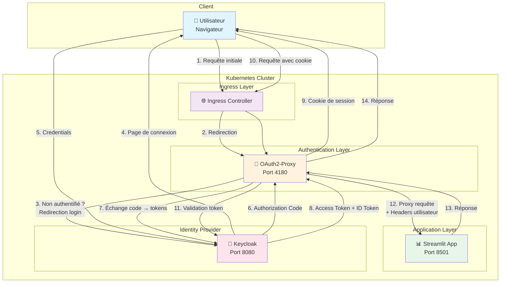
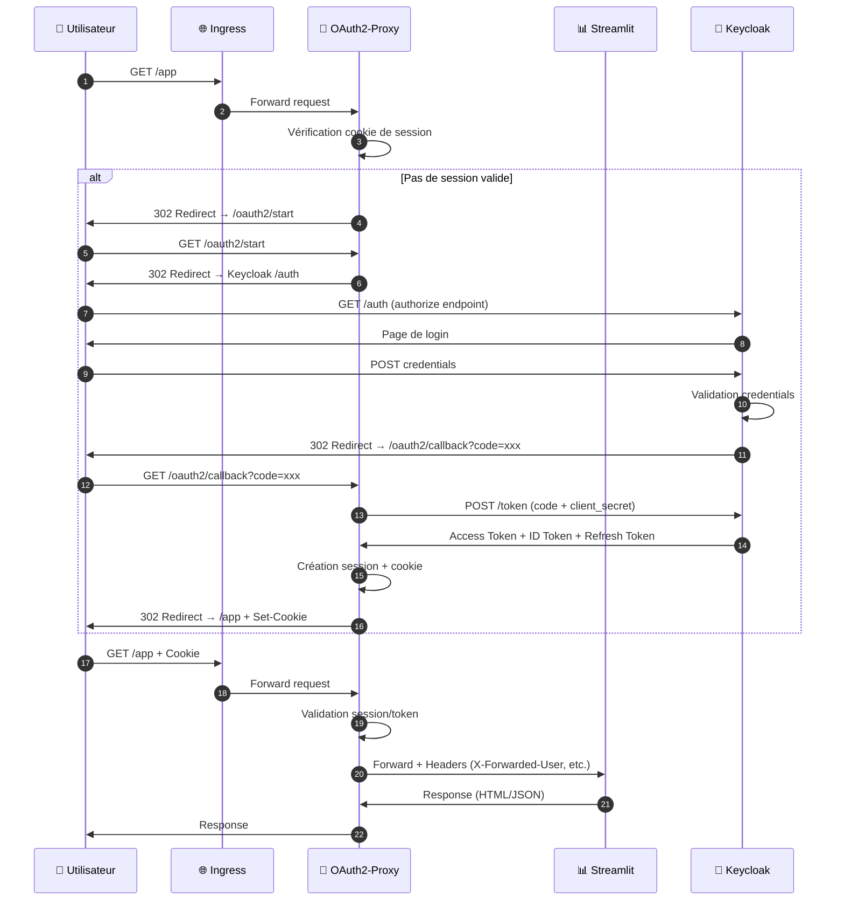

# Architecture OAuth2-Proxy + Streamlit + Keycloak

## Vue d'ensemble

Ce document décrit l'architecture de protection d'une application Streamlit avec OAuth2-Proxy et Keycloak comme fournisseur d'identité.

## Schéma d'architecture

## Flux d'authentification

| Étape | Description |
|-------|-------------|
| 1-2 | L'utilisateur accède à l'application via l'Ingress |
| 3-4 | OAuth2-Proxy détecte l'absence de session et redirige vers Keycloak |
| 5-6 | L'utilisateur s'authentifie, Keycloak renvoie un code d'autorisation |
| 7-8 | OAuth2-Proxy échange le code contre des tokens (OIDC flow) |
| 9 | Un cookie de session sécurisé est créé côté client |
| 10-12 | Les requêtes suivantes passent par OAuth2-Proxy qui injecte les headers utilisateur |
| 13-14 | Streamlit répond, la réponse est relayée à l'utilisateur |

## Diagramme de séquence

## Headers injectés par OAuth2-Proxy

OAuth2-Proxy injecte automatiquement les headers suivants vers l'application protégée :

| Header | Description |
|--------|-------------|
| `X-Forwarded-User` | Nom d'utilisateur authentifié |
| `X-Forwarded-Email` | Email de l'utilisateur |
| `X-Forwarded-Groups` | Groupes/rôles de l'utilisateur |
| `X-Forwarded-Access-Token` | Token d'accès JWT (si configuré) |
| `X-Forwarded-Preferred-Username` | Username préféré |

## Composants

### OAuth2-Proxy

- **Rôle** : Reverse proxy d'authentification
- **Port** : 4180
- **Fonction** : Intercepte toutes les requêtes et vérifie l'authentification

### Streamlit

- **Rôle** : Application web Python
- **Port** : 8501
- **Fonction** : Application métier protégée

### Keycloak

- **Rôle** : Identity Provider (IdP) OpenID Connect
- **Port** : 8080
- **Fonction** : Gestion des utilisateurs, authentification, émission de tokens

### Ingress Controller

- **Rôle** : Point d'entrée du cluster
- **Fonction** : Routage TLS, load balancing
